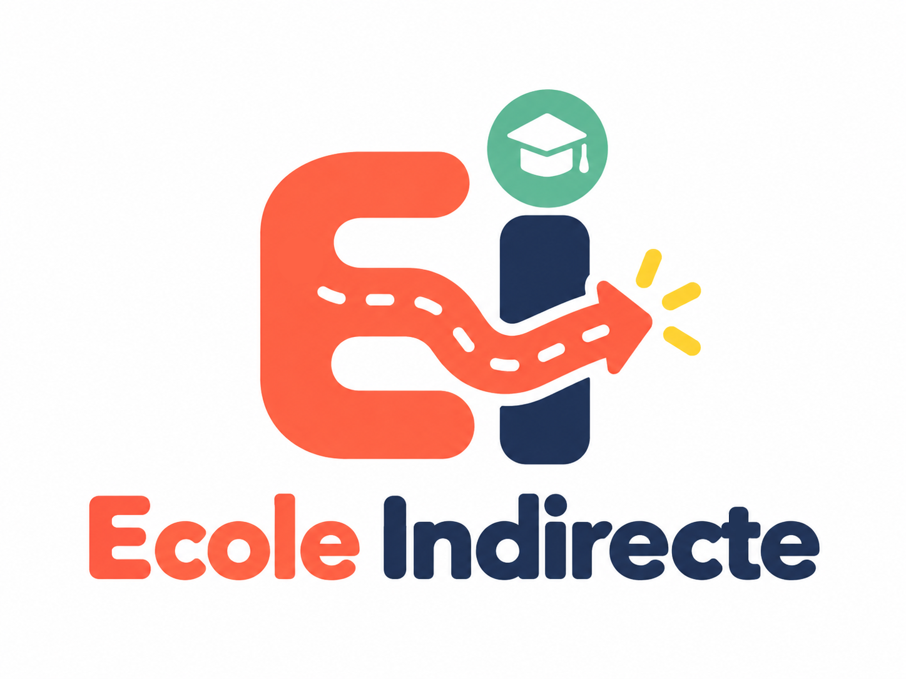

  

# Ecole Indirecte :

Ecole Indirecte est une application mobile pour les étudiants, elle sert à moduler à la convenance de l'étudiant et de pouvoir discuter en directe avec les autres !

C'est un projet, réalisé dans la cadre de notre formation en BTS SIO option SLAM, pendant notre seconde année. 
