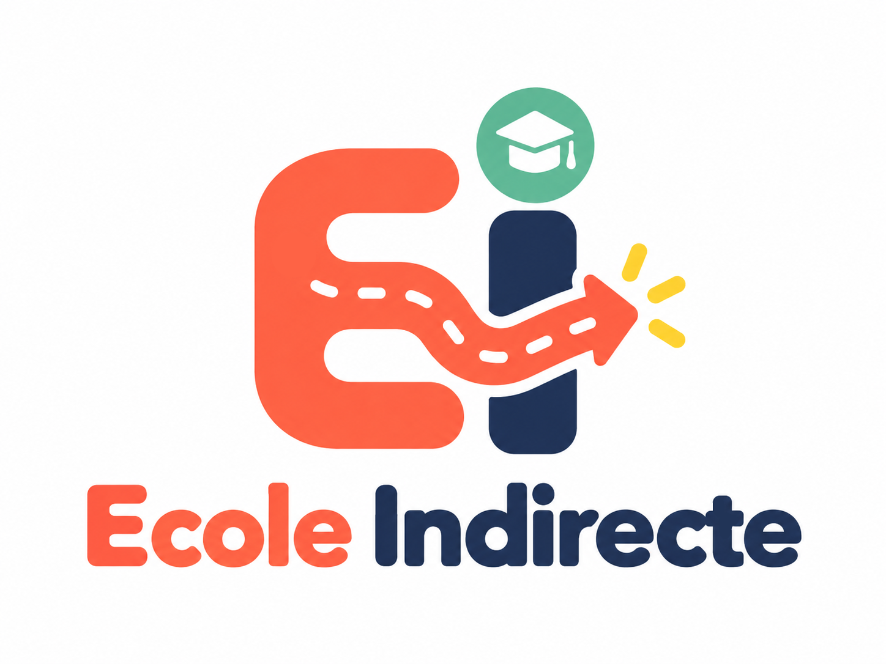

  

<table align="center">
  <tr>
    <td align="center" width="96">
      
       PHP
    </td>
        <td align="center" width="96">
      
       JavaScript
    </td>
    <td align="center" width="96">
      
       HTML 
    </td>
    <td align="center" width="96">
      
       CSS
  <td align="center" width="96">
      
       MariaDB 
    </td>
    <td align="center" width="96">
      
       SQL
    </td>
    
  </tr>
</table>

# Ecole Indirecte :

**Ecole Indirecte** est une application mobile destinée aux étudiants. Elle permet de moduler l'interface à la convenance de l'utilisateur et de discuter en direct avec d'autres étudiants !

Ce projet est réalisé dans le cadre de notre formation en **BTS SIO option SLAM** (Solutions Logicielles et Applications Métiers), lors de notre seconde année.

---

## Client Lourd (Application Mobile) :

### Pourquoi ce projet ?

Ce projet a été pensé pour accompagner au mieux les étudiants dans leur vie au lycée. L'objectif est de leur permettre de s'organiser efficacement entre leurs études et leur vie personnelle, notamment grâce à la modification personnalisée de l'emploi du temps.

De plus, la possibilité de personnaliser l'interface de l'application permet un accès plus rapide aux informations essentielles. Par exemple, un élève qui consulte systématiquement son emploi du temps en ouvrant l'application pourra choisir de l'afficher directement sur sa page d'accueil.

### Par qui ce logiciel sera-t-il utilisé ?

Dans cette partie du projet, nous distinguons deux types d'utilisateurs :
* **Les Etudiants**
* **Les Professeurs** (Qui seront définis dans des comptes spécifiques)

---

## Client Léger (Application Web) :

### Pourquoi ce projet ?

Cette interface va être utilisée par les administrateurs et les professeurs.

Dans le cadre de notre projet de BTS SIO, nous devons obligatoirement concevoir deux types d’applications : un client lourd et un client léger. Nous avons fait le choix de développer un client lourd pour les professeurs et les étudiants, car ces utilisateurs consulteront l'outil principalement sur smartphone. Par conséquent, une application légère, accessible directement depuis un navigateur web, nous a semblé beaucoup plus adaptée aux besoins de gestion des administrateurs et du support technique.

### Par qui ce logiciel sera-t-il utilisé ?

* **Les Administrateurs**
* **Les Supports techniques ( Optionnel)** 
* **Les Professeurs**
* **Les Etudiants**

---

## Contraintes et Solutions Techniques :

### Contraintes :

Ce projet a une contrainte technique majeure l'utilisation de l'API : Au début du projet, nous avions pour but de récupérer les informations d'École Directe via une API, malheuresement l'API d'Ecole Directe n'est pas publique et il est donc impossible pour nous de l'utiliser. Il existe bien des API créées par la communautée disponible en Open Source, mais elles ne sont malheureusement pas suffisamment fonctionnelles ou stables pour notre projet.

### Solution :

Pour pallier à ce problème, nous avons choisi de créer nous-mêmes nos jeux de données. Nous avons donc intégré dans notre propre base de données toutes les informations nécessaires à la simulation, telles que les emplois du temps, les notes, le cahier de textes et toutes les autres informations nécéssaires pour la bonne réalisation de notre projet.

---

## Fonctionnalités proposées :

Voici les fonctionnalités prévues pour chaque type d'utilisateur, certaines fonctionnalitées sont marquées en optionnel car elle ne sont pas prioritaires dans notre projet initial :

**L'étudiant aura accès aux fonctionnalités suivantes (Client Lourd) :**
* Accès simplifié à l'emploi du temps.
* Interface modulable (ex: possibilité de mettre l'emploi du temps en page d'accueil).
* Ajout d'heures personnelles dans l'emploi du temps.
* Notifications en cas de changement d'emploi du temps.
* Chat de discussion privé entre classes.
* Système de tickets (Support) en cas de problème avec le logiciel **(Optionnel)**.
* Consultation du menu du jour au self.

**L'administrateur aura accès aux fonctionnalités suivantes (Client Léger) :**
* Gestion du support de l'application (accès, lecture et réponse aux tickets étudiants).
* Accès à certaines données confidentielles (sous réserve des droits et rôles accordés).
* Gestion des utilisateur.
* Gestion des rôles et permissions.
* consultations des logs.
* Envoie messages générales.
* Envoyer des messages privés.
* Gestion des emplois du temps.

**Support informatique (Optionnel)** :
* Gestion des tickets (modification, Création, Supression, Archiver)
* consulter liste des tickets
* Répondre aux tickets

**Les professeurs auront accès aux fonctionnalités suivantes (Client Lourd et Léger) :**
* Accès aux discussions de groupe (si un groupe incluant des élèves a été créé).
* Créer des devoirs.
* Envoyer des messages privés ou générales.
* Supprimer des devoirs.
* Accès à l'emploi du temps.
* Consulter le menu du self.
* Système de tickets en cas de problème.**(Optionnel)**
---

## Technologies utilisées :

### Version Légère (Client Web) :

* **MariaDB (Base de données SQL) :**  Pour la gestion et le stockage des données de l'application nous décidons de tout héberger sur les serveurs PhpMyAdmin qui sont installés sur nos VM distantes au lycée.
* **PHP :**  Pour développer le côté serveur (backend) et la logique métier, nous allons utiliser le language Php grâce aux cours que nous avons eux l'année dernière.
* **JavaScript :**  Pour rendre l'interface web dynamique et interactive côté utilisateur, c'est le language JavaScript qui sera utilisé dans notre projet.
* **HTML et CSS :**  Pour la structure et l'habillage graphique de notre site web.

### Version Lourde (Client Mobile) :

* **Flutter :**  Ce framework polyvalent permet de développer et de compiler l'application pour plusieurs systèmes d'exploitation (comme iOS et Android) à partir d'une seule et même base de code.
* **Dart :** En nous basant sur le framework Flutter, pour programmer une grande partie de notre application.
* **PHP :**  Pour développer le côté serveur (backend) et la logique métier, nous allons utiliser le language Php grâce aux cours que nous avons eux l'année dernière.
